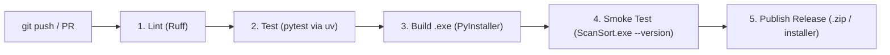

# Product Requirements Document (PRD)
# ScanSort: AI-Powered Scanner Document Ingestion & Organization Service

**Target Platform:** Windows 10 / 11 (64-bit)  
**Project Name:** ScanSort  
**CLI / Module:** `scansort`  
**Document Status:** Approved Architecture v1.1  
**Date:** 2026-09-03  

---

## 1. Executive Summary

This project specifies a lightweight, robust Windows application that automates the post-scan workflow for physical paperwork. Scanners typically deposit raw files (e.g., `scan_0001.pdf` or `scan_0001.jpg`) into a designated watch folder. This application continuously monitors that drop folder, ensures the file has finished writing, analyzes the document's visual content using Google Gemini's native multimodal capabilities (OCR, context extraction, date recognition), standardizes the filename into a uniform `YYMMDD_<description>.pdf` format, and dispatches the document into the appropriate pre-existing subfolder inside the user's `Documents` directory.

---

## 2. Problem Statement & User Journey

### 2.1 The Problem
- Physical documents scanned via feeder or flatbed scanners are typically saved with non-descriptive names (e.g., `Scan20260903_001.pdf`) in a single dumping ground folder.
- Manual inspection, renaming, and filing into topic-specific directories (`Documents/Finances/Banking`, `Documents/Medical/Receipts`, `Documents/Utilities`, etc.) creates significant cognitive overhead and friction.
- Traditional local OCR tools (like Tesseract) only produce raw unformatted text and lack semantic comprehension to deduce what the document actually represents, when it was issued, and where it belongs in an existing folder hierarchy.

### 2.2 Target User Journey
1. **User scans a document** (e.g., a power bill, medical receipt, or insurance renewal) from their desktop or network scanner into `C:\Scans\Inbox`.
2. **Application detects the new file** and monitors it until the scanner finishes writing and closes the file handle.
3. If the input is an image (JPG, PNG, TIFF), it is converted into a standard PDF document (or processed as-is, depending on configuration).
4. **Folder cataloging:** The app reads the existing subfolder structure under `%USERPROFILE%\Documents` (e.g., `Finances`, `Taxes`, `Insurance/Car`, `Home/Utilities`).
5. **Gemini Multimodal Analysis:** The file content and the current folder list are passed to the Gemini API with a strict JSON schema prompt:
   - **Document Date:** Extract the document's actual issuance/invoice date (formatted as `YYMMDD`).
   - **Description:** Generate a clean, concise, snake_case or TitleCase label (e.g., `Origin_Energy_Electricity_Bill`).
   - **Target Folder:** Select the most accurate pre-existing folder from the provided list, or tag as `_Unsorted` if no match fits with high confidence.
6. **File Dispatch:** The file is renamed to `YYMMDD_<description>.pdf` and moved to `Documents/<target_folder>/`.
7. **Notification:** A Windows desktop toast notification alerts the user:  
   *"Filed '260901_Origin_Energy_Electricity_Bill.pdf' into 'Documents/Utilities'."*

---

## 3. Gemini API: Feasibility & Subscription Clarification

### 3.1 Can Gemini Be Used This Way?
**Yes, exceptionally well.** In fact, Gemini 1.5/2.0/2.5 Flash is arguably the ideal model family for this task because:
- **Native Document Understanding:** Gemini natively accepts multi-page PDF files and images directly in its multimodal context. There is no need for local Tesseract OCR, Poppler binaries, or preliminary text extraction pipelines.
- **Combined OCR + Semantics:** In a single API call, Gemini performs both visual text recognition and high-level reasoning (determining who the bill is from, finding the billing date rather than the payment due date or scan date, and picking the right folder).
- **Structured JSON Outputs:** Gemini supports native JSON schema enforcement (`response_mime_type="application/json"` with `response_schema`), guaranteeing deterministic parsing without brittle prompt hacks.

### 3.2 Subscription vs. API Key: Critical Distinction
> [!IMPORTANT]
> **Google One AI Premium / Gemini Advanced Subscriptions:**  
> A consumer Gemini subscription (e.g., Google One AI Premium) is designed exclusively for consumer web chat (`gemini.google.com`) and Google Workspace integrations (Gmail, Google Docs). **Google does not provide programmatic API keys under consumer Google One subscriptions.** Programmatic access requires an API key generated via [Google AI Studio](https://aistudio.google.com/).

### 3.3 Verified Google AI Studio Free Tier Specifications & Privacy Alert
Based on Google's official API documentation:

#### 1. Verified Rate Limits (Per Google Cloud Project)
| Model | RPM (Req/Min) | TPM (Tokens/Min) | RPD (Req/Day) | Reset Time |
| :--- | :--- | :--- | :--- | :--- |
| **Gemini 2.0 Flash / 1.5 Flash** | **15 RPM** | **1,000,000 TPM** | **1,500 RPD** | Midnight Pacific Time |
| **Gemini 2.5 Flash** | **10–15 RPM** | **1,000,000 TPM** | **1,500 RPD** | Midnight Pacific Time |
| **Gemini 2.5 Pro** | **5 RPM** | Variable | **50 RPD** | Midnight Pacific Time |

* **Document Payload Limits:** PDF files up to **2 GB** (or 1,000 pages) via the free Files API, or up to **100 MB** inline. Document pages consume ~258 tokens per page.
* **Storage Limits:** The Files API provides **20 GB of free project storage** with automatic 48-hour expiration.

#### 2. Critical Data Privacy Notice for Scanned Documents
> [!WARNING]
> **Free Tier Data Privacy & Human Review Policy:**  
> Under Google AI Studio's **Free Tier ("Unpaid Services")**, Google's terms explicitly state that:
> - Submitted prompts, documents, and model outputs **may be used by Google to train and improve its machine learning models**.
> - **Human reviewers may read and annotate** submitted data (de-identified from account ID).
> - Google explicitly cautions against submitting sensitive, confidential, or personally identifiable information (PII) on the Free Tier.
>
> **Implication for Scanned Paperwork:** Scanned documents frequently contain sensitive personal data (e.g., bank statements, tax documents, medical receipts, invoices with home addresses).  
> **Recommendation:** While the Free Tier is great for testing and non-sensitive documents, users handling sensitive financial/personal papers should link a Google Cloud billing account (Paid Tier). On the Paid Tier:
> - Data is **strictly confidential and NOT used to train Google models**.
> - **No human reviewers** inspect your documents.
> - The cost remains negligible: at ~$0.10 per million tokens, 100 typical scanned bills cost approximately **$0.01 to $0.02 (1–2 cents/month)**.

---

## 4. Functional Requirements

### 4.1 Configurable Drop Folder & Ingestion Pipeline

ScanSort allows the user to specify any directory as the monitored scanner drop inbox (e.g., a local folder `C:\Scans\Inbox`, a shared network folder, or a secondary drive location).

#### 4.1.1 Drop Folder Configuration & Selection
- **Configurable Via Multiple Methods:**
  - **Interactive Windows Folder Picker:** Native folder browser dialog accessible from the System Tray menu (*"Change Drop Folder..."*) and Settings dialog.
  - **Configuration File:** Specified in `config.json` under `watch_folder`.
  - **Command-Line Override:** Can be launched with `--watch-folder <path>` or `-w <path>`.
- **Default Resolution & Auto-Creation:**
  - If unset, defaults to `%USERPROFILE%\Scans\Inbox`.
  - If the configured drop folder path does not exist on disk, ScanSort automatically and safely creates it on startup.
- **Dynamic Hot-Switching:**
  - When the user updates the drop folder via the UI or settings, the active `watchdog` observer dynamically unregisters the old path and begins watching the new path immediately without restarting the application.
- **Path Validation:**
  - Validates that the path is an accessible directory with appropriate read, write, and delete/move permissions before activating the watcher.

#### 4.1.2 File Ingestion & Stabilization
- **Supported Formats:** `.pdf`, `.jpg`, `.jpeg`, `.png`, `.tiff`, `.tif`.
- **File Stability & Lock Handling:**
  - Physical scanners writing multi-page ADF scans over Wi-Fi or USB stream data in chunks over several seconds and maintain exclusive write locks.
  - The watcher implements a polling stabilizer: verifies file size remains unchanged over a sampling window (e.g., 2–3 seconds) and attempts an exclusive read lock before feeding the file into the processing pipeline.
- **Image-to-PDF Normalization:**
  - Scanned single or multi-page image files are automatically converted into standardized `.pdf` files via `Pillow` and `img2pdf` before Gemini analysis and final filing.

### 4.2 Configurable Documents Root & Folder Mapping Engine ("Folder Mapper")

The user can define the root directory where processed documents will be organized (defaulting to the system Documents folder, with full support for custom local paths, secondary drives, or OneDrive synced folders).

#### 4.2.1 Document Root Configuration
- **Configurable Path:** Users can specify any absolute folder path (e.g., `D:\Personal\Documents`, `C:\Users\Stephen\OneDrive\Documents`).
- **Auto-Discovery:** By default, auto-resolves `%USERPROFILE%\Documents` or detects OneDrive redirection.
- **Validation:** Verifies the path exists and has read/write permissions on startup.

#### 4.2.2 Folder Pre-Scan & Map Construction
Before processing incoming scans, the app scans the target Documents root to build a comprehensive **Folder Map (Taxonomy Index)**:
- **Recursive Directory Walk:** Recursively traverses the directory tree up to a configurable depth (default: 3 levels deep).
- **Normalized Relative Paths:** Outputs clean, normalized relative paths (e.g., `Finances/Banking/ANZ`, `Finances/Taxes`, `Health/Medical`, `Utilities/Electricity`, `Insurance/Auto`).
- **Exclusion & Noise Filtering:** Automatically skips directories that should not receive scanned documents:
  - System and application storage folders: `My Games`, `My Music`, `My Pictures`, `My Videos`, `Custom Office Templates`, `OneNote Notebooks`, `Zoom`, `Virtual Machines`, `Adobe`, `PowerToys`.
  - Hidden and system directories (folders starting with `.` or carrying the Windows hidden attribute).
  - User-configurable blacklist (e.g., ability to exclude specific work or private folders).
- **Internal Representation:**
  - **Flat List:** An array of valid relative paths passed directly to Gemini for exact classification.
  - **Hierarchical Tree:** A JSON tree structure used for UI visualization and user review.

#### 4.2.3 Folder Map Caching & Synchronization
- **Local Persistence:** The mapped taxonomy is serialized to a local cache (`folder_map.json`) with timestamps and folder counts, allowing fast startup without rescanning large drives on every boot.
- **Dynamic Synchronization:**
  - **Manual Trigger:** "Rescan / Refresh Folder Map" option in the System Tray menu and Settings GUI.
  - **Filesystem Watcher / Periodic Check:** A lightweight watcher or time-to-live (TTL) check ensures any newly created or renamed folders in Windows Explorer are automatically picked up and added to the folder map.
  - **Pre-Filing Check:** If Gemini recommends a folder that doesn't exist, or if the destination directory has been moved, the app checks the live filesystem before filing.

#### 4.2.4 Gemini Integration with Folder Map
- The mapped list of valid subfolders is embedded dynamically into Gemini's system instructions and prompt:
  ```text
  You are an expert document archivist. Given the following list of PRE-EXISTING user folders:
  [
    "Finances/Banking/ANZ",
    "Finances/Taxes/2025-2026",
    "Health/Medical/Receipts",
    "Insurance/Home_and_Contents",
    "Insurance/Vehicle",
    "Utilities/Electricity",
    "Utilities/Water"
  ]
  Analyze the provided document, extract the document date (YYMMDD), produce a clean description, and select the BEST matching folder from the list above. If none matches with confidence >= 0.70, output target_folder: "_Review_Needed".
  ```

### 4.3 Gemini Document Analysis & Model Evaluation

#### 4.3.1 Model Comparison & Cost Breakdown

| Model | Status | Cost / 1M Input Tokens | Cost / 1M Output Tokens | OCR & Extraction Accuracy | Recommended For |
| :--- | :--- | :--- | :--- | :--- | :--- |
| **Gemini 1.5 Flash** | Deprecated / Legacy | ~$0.075 | ~$0.30 | Baseline multimodal OCR | Replaced by 2.x/2.5 |
| **Gemini 2.0 Flash** | EOL (March 2026) | ~$0.10 | ~$0.40 | Good multimodal speed | Phased out |
| **Gemini 2.5 Flash** *(Selected)* | **Active Current** | **~$0.15** | **~$0.60** | **Superior on low-contrast, skewed, wrinkled scans & reasoning** | **Primary choice** (accurate date & classification) |
| **Gemini 2.5 Flash-Lite** | **Active Current** | **~$0.075** | **~$0.30** | Fast, high-throughput extraction | High-volume batch fallback |

#### 4.3.2 Why Gemini 2.5 Flash Suits Your Needs
1. **Critical Date Disambiguation:** Physical paperwork (especially medical bills, power bills, rates notices) often contains 4 to 6 different dates: *Statement Date*, *Due Date*, *Meter Reading Period*, *Issue Date*, and *Payment Received Date*. Earlier models often grabbed the due date or payment date by mistake. Gemini 2.5 Flash's enhanced reasoning reliably identifies the actual document issuance date.
2. **Scanner Artifact Handling:** Real-world scans from home/office scanners frequently suffer from slight angle rotation, staple shadows, fold creases, and uneven lighting. 2.5 Flash handles visual noise significantly better than 1.5/2.0.
3. **Real-World Cost Math:**
   - Average scan: 2 pages (~516 tokens) + system instructions & folder list (~300 tokens) = **~800 input tokens**.
   - Structured JSON response = **~60 output tokens**.
   - Cost per document on paid tier: **$0.000156 (approx 1/60th of a single cent)**.
   - Cost on Free Tier: **$0.00 (Free up to 1,500 scans/day)**.
   - Scanning **1,000 documents** costs approximately **$0.16 (16 cents total)**.
4. **Optimizing Latency & Cost via Config:**
   - In the API request, set `thinking_config={"thinking_budget": 0}` (or minimal) since document classification and metadata extraction do not need verbose chain-of-thought, keeping responses fast (~1–2 seconds) and output token usage minimal.

#### 4.3.3 Structured JSON Schema
```json
{
  "document_date": "YYMMDD",
  "description": "Short_Descriptive_Title_In_English",
  "target_folder": "Deepest/Specific/Subfolder/Path",
  "confidence": 0.95,
  "orientation_correction": 0,
  "document_type": "Invoice | Statement | Receipt | Letter | Medical | Contract | Blank | Other",
  "summary": "Brief 1-sentence summary of the document contents"
}
```

#### 4.3.4 Confirmed Fallback & Extraction Heuristics
- **Missing Date Fallback:** If no issuance date is legible or present on the document (e.g. ID card, passport, generic document), fall back directly to **today's scan date in `YYMMDD` format**.
- **Deepest Subfolder Matching:** Gemini is strictly instructed to file documents into the **deepest specific subfolder** available in the taxonomy (e.g., `Documents/Finances/Banking/ANZ` instead of higher-level `Documents/Finances`).
- **English Filename Standardization:** If a document is in a foreign language (e.g., a travel receipt in Japanese or French), the `<Description>` is always **translated to English** (e.g., `260901_Tokyo_Hotel_Receipt.pdf`).
- **Automated Page Orientation Correction:** Gemini evaluates whether the scanned document was fed upside-down or sideways and outputs `orientation_correction` (0, 90, 180, or 270 degrees). ScanSort automatically rotates the PDF pages via `pypdf` to ensure all archived PDFs are stored right-side up.
- **Strict Folder Fallback:** If confidence is below threshold (< 0.70) or no pre-existing folder in the mapped taxonomy fits, assign `target_folder` to **`_Review_Needed`**. ScanSort will **never** automatically create new topic folders without explicit user setup.
- **Single Job Ingestion:** The scanner generates a complete multi-page PDF per scan job; ScanSort treats each incoming file in the drop folder as an independent document (no page-stitching required).
- **Blank / Corrupt Scan Handling:** If Gemini detects an empty or blank page (`document_type: "BLANK"`), it routes directly to `_Review_Needed/Blank_Scans/` to prevent filing blank sheets.

### 4.4 Renaming, Filing & Comprehensive Audit Logging

#### 4.4.1 Renaming Convention & Collision Handling
- **Naming Convention:** `YYMMDD_<Description>.pdf`
  - **Style:** Strict **`Title_Case_With_Underscores`** (e.g., `260901_Origin_Energy_Electricity_Bill.pdf`).
  - **Sanitization:** All Windows invalid characters (`< > : " / \ | ? *`) and whitespace are stripped or replaced with underscores.
  - **Length Cap:** The `<Description>` component is capped at 60 characters to safeguard against Windows `MAX_PATH` (260 char) path limit errors.
- **Collision Handling:**
  - If `260901_Origin_Energy_Electricity_Bill.pdf` already exists in the destination folder, append counter: `260901_Origin_Energy_Electricity_Bill_1.pdf`.
- **Atomic Move:** The file is moved atomically from the drop folder to the destination directory once confirmed.
- **Undo Last Filing Action:** System Tray includes an *"Undo Last Move"* action. If clicked, ScanSort immediately reverses the last operation recorded in the audit log, moving the file back to the drop folder with its original name.

#### 4.4.2 Audit Logging Specification
ScanSort maintains an immutable, detailed audit record for every single document processed.

##### 1. Recorded Audit Fields:
```json
{
  "timestamp": "2026-09-03T10:41:00Z",
  "local_time": "2026-09-03 20:41:00",
  "original_filename": "scan_0001.pdf",
  "original_path": "C:\\Users\\Stephen\\Scans\\Inbox\\scan_0001.pdf",
  "new_filename": "260901_Origin_Energy_Electricity_Bill.pdf",
  "destination_folder": "Utilities/Electricity",
  "destination_path": "C:\\Users\\Stephen\\Documents\\Utilities\\Electricity\\260901_Origin_Energy_Electricity_Bill.pdf",
  "detected_date": "260901",
  "description": "Origin_Energy_Electricity_Bill",
  "confidence": 0.95,
  "summary": "Quarterly electricity bill from Origin Energy for 42 Wallaby Way.",
  "status": "SUCCESS"
}
```

##### 2. Storage Locations & Formats:
- **Primary Location (Windows AppData Standard):**
  - **`%APPDATA%\ScanSort\history.jsonl`**: Append-only JSON Lines format. Robust against system crashes; ideal for programmatic search, undo, or analytics.
  - **`%APPDATA%\ScanSort\history.csv`**: Human-readable CSV format with columns:
    `Timestamp | Original File | New Filename | Folder | Destination Path | Summary | Status`
    Can be opened directly in Microsoft Excel, Google Sheets, or Notepad.
- **Optional In-Documents Mirror:**
  - Users can enable *"Mirror history log to Documents folder"* in Settings, keeping an up-to-date `_ScanSort_History.csv` directly inside their `Documents/` root folder.
- **1-Click User Access:**
  - System Tray menu includes:
    - **"View Scan History"**: Opens `history.csv` (or `.jsonl`) immediately in the default viewer (Excel or Notepad).
    - **"Open Log Folder"**: Opens Windows Explorer directly to `%APPDATA%\ScanSort\`.

### 4.5 Configuration Entrypoints & User Interface

ScanSort provides four seamless, intuitive ways for users to enter and modify their configuration:

#### 4.5.1 First-Run Onboarding Wizard (First Launch)
When ScanSort is launched for the first time (or if no Gemini API key is detected in the vault):
- An onboarding dialog appears automatically:
  1. **Gemini API Key:** A password-masked field (`••••••••`) with a link to Google AI Studio and a **"Test API Key"** button that verifies connectivity with Gemini.
  2. **Scanner Drop Folder:** Shows default `%USERPROFILE%\Scans\Inbox` with a **"Browse..."** button opening native Windows folder picker.
  3. **Documents Root:** Shows auto-detected `%USERPROFILE%\Documents` with a **"Browse..."** button.
  4. **Run on Boot:** Checkbox *"Start ScanSort with Windows"* (checked by default).
  5. **Action:** Clicking **"Save & Start"** saves the API key to Windows Credential Manager, writes paths to `config.json`, starts the background watcher, and minimizes silently to the system tray with a welcome notification.

#### 4.5.2 System Tray Settings Dialog & Quick Actions
While ScanSort is running in the Windows taskbar tray, right-clicking reveals:
- **"Settings..."**: Re-opens the unified settings dialog to adjust folders, fallback behavior, or switch models (`gemini-2.5-flash` / `gemini-2.5-flash-lite`).
- **"Change Drop Folder..."**: Instant 1-click shortcut to the native Windows folder browser.
- **"Change Documents Folder..."**: Instant 1-click shortcut to the native Windows folder browser.
- **"Set / Update API Key..."**: Direct password-masked dialog with connection testing.
- **"Start with Windows"**: Checkable toggle to enable/disable startup shortcut.
- **"Pause / Resume Monitoring"**: Temporarily suspends folder ingestion.
- **"View Recent Logs"**: Opens `scan_history.jsonl` in default text editor.

#### 4.5.3 Command-Line Interface (CLI) Configuration
For advanced users, automation scripts, or headless server environments:
- `scansort config --set-key <API_KEY>`: Writes the key directly into Windows Credential Manager (masked).
- `scansort config --watch-folder "D:\Scans\Inbox"`: Updates the monitored directory.
- `scansort config --documents-folder "D:\Documents"`: Updates the destination root.
- `scansort config --show`: Displays current paths and settings with the API key redacted (`AIza••••••••1234`).
- `scansort --watch-folder "..."`: Overrides drop folder temporarily for a single session.

#### 4.5.4 Configuration File (`%APPDATA%\ScanSort\config.json`)
The application stores persistent paths in standard Windows AppData:
```json
{
  "watch_folder": "C:\\Users\\Stephen\\Scans\\Inbox",
  "documents_root": "C:\\Users\\Stephen\\Documents",
  "fallback_folder": "_Review_Needed",
  "gemini_model": "gemini-2.5-flash",
  "start_on_boot": true,
  "max_folder_depth": 3
}
```
*(Notice: The API key is strictly omitted from `config.json` and remains encrypted in Windows Credential Manager).*

### 4.6 Secrets Management & Security Architecture

To ensure the user's Gemini API key is never exposed, committed, or leaked, ScanSort enforces a multi-tier defense-in-depth security model:

1. **OS-Level Encrypted Storage (Windows Credential Manager via `keyring`):**
   - The primary storage for the API key is the native **Windows Credential Manager** (using Windows Data Protection API / DPAPI).
   - Target identity: `ScanSort/GeminiApiKey`.
   - The key is encrypted by Windows using the current user's login credentials. It is never stored as plaintext in `config.json`, `.env`, or anywhere in the filesystem.
2. **Environment Variable Fallback (`GEMINI_API_KEY`):**
   - Supports reading `GEMINI_API_KEY` from the system environment for headless or developer use.
   - The application never persists environment variables to disk.
3. **Strict Git & Repository Isolation:**
   - `.gitignore` explicitly bans `.env`, `*.key`, `config.json`, and local log databases from version control.
   - Only a sanitized `config.example.json` (containing empty/dummy fields) is tracked.
4. **Log & Trace Redaction:**
   - The audit logger and error handlers sanitize all logs, terminal outputs, and exception traces.
   - Any string matching the Gemini API key pattern (e.g. `AIza...`) is automatically masked to `AIza••••••••XXXX` before being logged.
### 4.7 Advanced Enhancements & Windows Integration

ScanSort incorporates five powerful features designed to make document ingestion frictionless, safe, and integrated into Windows:

#### 4.7.1 PDF Metadata Embedding (Windows Indexer Integration)
- When Gemini extracts the document date, description, category, and 1-sentence summary, ScanSort embeds this structured information directly into the PDF’s internal DocInfo and XMP metadata streams using `pypdf`:
  - `Title`: Extracted description (e.g., `Origin Energy Electricity Bill`)
  - `Subject`: Gemini summary (e.g., `Quarterly bill for 42 Wallaby Way totaling $342.10`)
  - `Keywords`: Category, vendor, document type, and tags
  - `Author`: ScanSort AI / Origin Energy
- **Why It Matters on Windows:** The **Windows Search Indexer** automatically indexes standard PDF metadata. Users can find any scanned document months later simply by typing vendor names, policy numbers, or summary keywords directly into the Windows Start Menu search bar.

#### 4.7.2 SHA-256 Duplicate Detection
- ScanSort computes a cryptographic SHA-256 hash of every incoming document before processing.
- The hash is checked against past records in `history.jsonl`.
- If an exact match is detected:
  - The file is flagged as an accidental duplicate scan.
  - To prevent burning unnecessary Gemini API tokens, the existing classification metadata is reused.
  - The file is routed safely to `_Review_Needed/Duplicates/` with a toast alert: *"Duplicate scan detected: already filed as '260901_Origin_Energy_Bill.pdf'"*.

#### 4.7.3 Clickable Toast: Jump to File in Windows Explorer
- When a document is filed, the Windows Action Center toast notification includes a direct click action and an *"Open in Folder"* button.
- Invoking the action executes Windows Explorer with the newly created file highlighted in place:
  ```cmd
  explorer.exe /select,"C:\Users\Stephen\Documents\Utilities\Electricity\260901_Origin_Energy_Electricity_Bill.pdf"
  ```

#### 4.7.4 Dry-Run / Preview Mode
- A toggle available via Settings, Tray menu (*"Enable Dry-Run"*), or CLI (`scansort --dry-run`).
- When active, ScanSort runs the full file stabilization, folder mapping, and Gemini classification pipeline, but **does not alter or move the file**.
- Instead, it logs the simulated action to console and toast:  
  *"[DRY RUN] Would rename 'scan001.pdf' to '260901_Origin_Energy.pdf' in 'Utilities/Electricity'"*.

#### 4.7.5 Folder Hints & Keyword Aliases (`folder_hints.json`)
- Users can provide optional keyword hints to help Gemini disambiguate personal folder categories:
  ```json
  {
    "Health/Dental": ["dentist", "teeth", "bupa", "orthodontic"],
    "Vehicles/Subaru": ["rego", "service", "mechanic", "tyres", "subaru"],
    "Finances/Taxes": ["ato", "tax return", "payment summary", "group certificate"]
  }
  ```
- These hints are merged into Gemini's system instructions alongside the folder taxonomy, ensuring flawless classification for personal domain-specific paperwork.

---

## 5. Selected Architecture & Modern Technology Stack (Python 3.12+ with Rust-Powered Cores)

The project leverages **Python 3.12+** managed by the **`uv` (Rust) toolchain** and supercharged by **Rust-backed Python extensions** for performance-critical tasks (debounced filesystem events and schema validation).

### 5.1 Component Breakdown & Library Specifications
| Module | Package / Library | Backing Tech | Verified Pattern & Why It's Best |
| :--- | :--- | :--- | :--- |
| **Watcher** | `watchfiles` | **Rust (`notify` crate)** | **Upgraded from `watchdog`**. Performs event debouncing directly at the Rust OS level before waking Python. Eliminates noise from scanners writing multi-page files incrementally. |
| **Toolchain & Env** | `uv` | **Rust** | Extremely fast environment creation, dependency resolution, and deterministic package locking (`uv.lock`). |
| **AI Client & Schema**| `google-genai` + `pydantic` | **Rust (`pydantic-core`)** | Official Google SDK with Pydantic v2 (Rust validation core) for microsecond JSON schema enforcement and inline PDF streaming. |
| **Secrets Vault** | `keyring` | Windows DPAPI | Securely stores key in native Windows Credential Manager. Zero plaintext keys on disk. |
| **PDF Metadata** | `pypdf` | Pure Python | Embeds XMP metadata (`Title`, `Subject`, `Keywords`) for native Windows Search indexing. |
| **Stability Checker** | Custom (`msvcrt`, `pathlib`) | Windows Native | Non-blocking exclusive file handle check (`msvcrt.locking`) + file-size delta verification. |
| **Folder Mapper** | `folder_mapper.py` | Python Standard Library | High-speed recursive taxonomy discovery + `folder_hints.json` integration; cached in `folder_map.json`. |
| **Folder Picker** | `tkinter.filedialog` | Windows Shell API | Invokes native Windows Shell `IFileDialog` directly without dragging in bulky 80MB GUI frameworks. |
| **Image to PDF** | `img2pdf` + `Pillow` | C-optimized streams | Lossless stream wrapping (no re-compression of JPEGs) preserving original scan DPI and image quality. |
| **System Tray** | `pystray` + `Pillow` | Windows Win32 API | Native Windows taskbar notification area integration with custom icon and context menu. |
| **Notifications** | `windows-toasts` / `win11toast` | Modern WinRT | Native Windows 10/11 Action Center toast notifications with clickable `explorer.exe /select` button. |
| **Packaging** | `PyInstaller` | C-Bootloader | Compiles application into a standalone Windows `.exe` with zero Python runtime install required on the host. |

---

## 6. Edge Cases & Resilience

1. **Scanner Writing Delay:** Scanner writes a 10MB 300DPI PDF over Wi-Fi. Watcher fires immediately on file creation. The app must wait until file size stops changing and file is unlocked before reading.
2. **Duplicate Documents:** User accidentally scans the same paper twice. App handles collision with index suffix (`_1`, `_2`) and logs a note.
3. **Empty / Blank Page Scans:** Gemini identifies blank page or failed scan; document is moved to `_Review_Needed/Blank_Scans`.
4. **Internet Disconnection / API Outage:** Scanned files remain in the watch folder (or a staging queue); retry mechanism with exponential backoff triggers once internet connectivity resumes.
5. **Rate Limiting:** If 20 documents are dumped at once, queue requests with a 2-second delay to comfortably stay within Google AI Studio's 15 RPM free-tier limit.

---

## 7. Test-Driven Development (TDD) Protocol & Implementation Cycles

### 7.1 Testing Framework Evaluation: Why `pytest` Powered by `uv` is the Best Choice
We researched modern Python testing tools, including emerging **Rust-based test runners**:
* **Experimental Rust Runners (`rtest`, `rpytest`, `Tryke`, `Karva`):** These tools leverage Rust to speed up static AST test collection in massive corporate monorepos (50,000+ tests). However, they are experimental, lack full compatibility with the deep ecosystem of `pytest` fixtures, lack mature mocking integrations (`unittest.mock`), and have limited plugin support.
* **The Winning Architecture (`uv` + `pytest`):**
  - **Runner & Framework:** **`pytest`** remains the undisputed industry gold standard for readability, expressive assertions (`assert x == y`), fixture-based dependency injection, and parametrization.
  - **Rust-Powered Environment & Execution:** Managed via **Astral's Rust-based `uv`** (`uv run pytest -v`). `uv` resolves dependencies and initializes the testing environment virtually instantaneously.
  - **Linter & Formatter:** **`Ruff`** (Astral's Rust linter) for sub-millisecond code quality verification (`uv run ruff check .`).
  - **Execution Speed:** Because ScanSort's unit test suite mocks all network I/O and hardware file locks, the entire `pytest` test suite executes in **< 0.5 seconds** locally.

ScanSort is developed strictly adhering to **Test-Driven Development (TDD)** using `pytest` via `uv`:
1. **Red**: Write the test suite first defining contracts, edge cases, error modes, and expected outputs. Run `uv run pytest` to confirm test failure.
2. **Green**: Implement the minimal, clean production code to pass all test cases. Run `uv run pytest` to confirm all green.
3. **Refactor**: Optimize performance, types, docstrings, and styling while maintaining 100% test pass rate.

### 7.2 TDD Cycles Matrix
| Cycle | Test Module | Implementation Target | Focus & Invariants |
| :--- | :--- | :--- | :--- |
| **Cycle 1** | `tests/test_secrets.py` | `scansort/secrets.py` | Windows Credential Manager storage, environment fallback, API key masking (`AIza••••••••XXXX`). |
| **Cycle 2** | `tests/test_config.py` | `scansort/config.py` | Custom drop folder, documents root, auto-creation of missing directories, persistence to `config.json`. |
| **Cycle 3** | `tests/test_folder_mapper.py` | `scansort/folder_mapper.py` | Recursive traversal, max-depth limit, noise filtering (`My Games`, `Zoom`, hidden dirs), caching to `folder_map.json`. |
| **Cycle 4** | `tests/test_file_stabilizer.py`| `scansort/file_stabilizer.py`| Simulated slow scanner writes, size-growth polling, exclusive file-lock acquisition. |
| **Cycle 5** | `tests/test_image_converter.py`| `scansort/image_converter.py`| Lossless JPG wrapping via `img2pdf`, PNG conversion, PDF passthrough. |
| **Cycle 6** | `tests/test_dispatcher.py` | `scansort/dispatcher.py` & `audit_logger.py` | Filename sanitization (`YYMMDD_<desc>.pdf`), collision counter (`_1`, `_2`), atomic move, redacted log output. |
| **Cycle 7** | `tests/test_gemini_client.py` | `scansort/gemini_client.py` | Pydantic schema validation, prompt taxonomy injection, mock API response parsing, fallback routing. |
| **Cycle 8** | `tests/test_watcher.py` | `scansort/watcher.py` | `watchfiles` debouncing, ignoring `.tmp` files, worker queue dispatch, dynamic folder hot-switching. |
| **Cycle 9** | `tests/test_integration.py` | End-to-end CLI & Tray | Full document ingestion pipeline: drop file -> stabilized -> converted -> mapped -> dispatched -> notified. |

---

## 8. Deployment, Packaging & CI/CD Pipeline

ScanSort is engineered for seamless distribution and unattended execution on Windows 10 and 11.

### 8.1 Standalone Binary Packaging (PyInstaller)
- **Tool:** `PyInstaller` invoked via `uv run pyinstaller scansort.spec`.
- **Packaging Mode:** Single-folder or single-file executable (`ScanSort.exe`).
- **Windowing:** `--noconsole` / `--windowed` ensures the application runs quietly in the system tray without popping up a lingering terminal window.
- **Embedded Assets:** Application icon (`assets/scansort.ico`) and default metadata embedded into the PE header.
- **Zero Python Prerequisite:** End-users do not need Python, C++ runtimes, or any developer tools installed.

### 8.2 Windows Auto-Start / Run-on-Boot Architecture (`scansort/autorun.py`)

ScanSort includes full native support for automatic startup when Windows boots:

#### 1. Implementation Mechanism
- **Primary Method (`winreg` Standard Library):**
  - Manages the Windows Current User Run key:
    `HKEY_CURRENT_USER\Software\Microsoft\Windows\CurrentVersion\Run`
  - Key Name: `ScanSort`
  - Key Value: `"C:\path\to\ScanSort.exe" --minimized`
  - **No Admin / UAC Required:** Runs entirely under standard user privileges.
  - **Task Manager Integration:** Automatically listed in Windows 10/11 Task Manager under the *"Startup Apps"* tab, showing app name and publisher.
- **Fallback Method (Startup Folder):**
  - For portable non-registry setups, creates/removes a standard shortcut in:
    `%APPDATA%\Microsoft\Windows\Start Menu\Programs\Startup\ScanSort.lnk`

#### 2. Silent Boot Behavior
- When launched via startup (detected via `--minimized` flag or autorun trigger), ScanSort **does not display any splash screen or dialogs**.
- It initializes quietly, checks the vault, scans the folder map in the background, docks directly into the system tray, and begins watching the drop folder immediately.

#### 3. User Controls for Auto-Start
- **First-Run Wizard:** Checkbox *"Start ScanSort automatically when Windows starts"* (checked by default).
- **System Tray Menu:** Interactive toggle `[x] Start with Windows` (updates registry in real time).
- **Settings Dialog:** Checkbox toggle in the General settings tab.
- **CLI Command:** `scansort config --autostart enable` / `scansort config --autostart disable`.

### 8.3 Automated CI/CD Pipeline (GitHub Actions)
Continuous Integration and Delivery is orchestrated via GitHub Actions using native Windows runners (`windows-latest`):



### 8.4 Default Installation Paths & Windows Directory Topology

On Windows 10 and 11, ScanSort strictly adheres to standard per-user filesystem conventions:

| Component | Default Windows Path | Purpose |
| :--- | :--- | :--- |
| **Application Binary** | `%LOCALAPPDATA%\Programs\ScanSort\ScanSort.exe`<br>*(e.g., `C:\Users\<User>\AppData\Local\Programs\ScanSort\`)* | **Where the app is installed.** Standard location for modern desktop apps (like VS Code, Chrome user-installs). Installs and updates with **zero UAC / Admin elevation prompts**. |
| **Configuration & State** | `%APPDATA%\ScanSort\`<br>*(e.g., `C:\Users\<User>\AppData\Roaming\ScanSort\`)* | Stores `config.json`, `folder_map.json`, `folder_hints.json`. Persists across app updates. |
| **Audit Logs** | `%APPDATA%\ScanSort\history.csv`<br>`%APPDATA%\ScanSort\history.jsonl` | Append-only audit trail recording every document rename and destination path. |
| **Monitored Drop Folder** | `%USERPROFILE%\Scans\Inbox\`<br>*(e.g., `C:\Users\<User>\Scans\Inbox`)* | Scanner deposits raw files here. Completely configurable. Auto-created if missing. |
| **Destination Documents** | `%USERPROFILE%\Documents\`<br>*(or `%USERPROFILE%\OneDrive\Documents\`)* | Organized destination root containing pre-existing subfolders. Completely configurable. |
| **Start Menu Shortcut** | `%APPDATA%\Microsoft\Windows\Start Menu\Programs\ScanSort.lnk` | Standard Windows Start Menu launcher. |
| **API Key Storage** | **Windows Credential Manager (DPAPI Vault)** | Encrypted by Windows. Stored securely under target `ScanSort/GeminiApiKey` (never stored in plaintext files). |


1. **Pull Request / Push Workflow (`ci.yml`):**
   - **Environment:** `windows-latest` runner.
   - **Setup:** Astral's `setup-uv` action.
   - **Lint & Format:** `uv run ruff check .` and `uv run ruff format --check .`.
   - **Test Matrix:** `uv run pytest -v --cov=scansort` with test coverage reports.
2. **Release Workflow (`release.yml` on tag `v*.*.*`):**
   - Runs full test suite.
   - Compiles standalone `ScanSort.exe`.
   - Bundles into `ScanSort-vX.Y.Z-windows-x64.zip`.
   - Optionally builds standard Windows 1-click installer (`ScanSort-Setup.exe`) via Inno Setup.
   - Creates GitHub Release with release notes and uploaded binaries.
