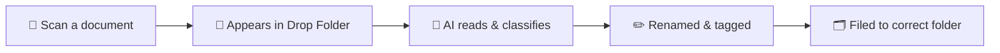
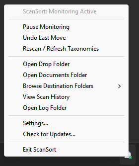
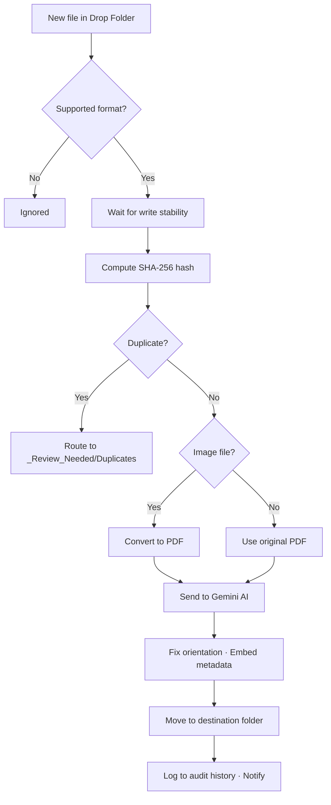

# ScanSort

[](https://github.com/stephenwong/scansort/actions/workflows/ci.yml)
[](https://github.com/stephenwong/scansort/releases/latest)
[](https://www.python.org)
[](https://github.com/stephenwong/scansort/releases/latest)
[](https://ai.google.dev/)

> **Scan it. Drop it. Done.**

ScanSort is a set-and-forget Windows desktop app that watches your scanner's output folder, automatically classifies each document using Google Gemini AI, and files it into the right place in your existing Documents folder — correctly named, right-side up, and searchable.

---

## ⚡ How It Works



You scan a document. ScanSort picks it up, waits for the scanner to finish writing, sends it to Gemini AI for classification, renames it with a clean date-stamped title, embeds searchable metadata, fixes the page orientation if needed, and moves it to the deepest matching subfolder in your Documents directory. If it can't confidently classify something, it places it in `_Review_Needed` for you to handle — it never invents folders or loses files.

---

## Features

### 🤖 Smart AI Classification

- 📖 **Reads your documents** — Gemini AI examines the full content of each scan (text, logos, layouts) and picks the best folder from your existing directory structure.
- 🌳 **Uses your folder structure** — ScanSort discovers your real Documents hierarchy and matches scans to the deepest, most specific subfolder. No setup or folder configuration required.
- ✈️ **Event & trip awareness** — Folders like `2026 Sydney Marathon` or `Tokyo Trip 2025` are recognised automatically. ScanSort cross-references document dates and locations against event timing to route related receipts, tickets, and invoices correctly.
- 💡 **Keyword hints** — Optionally provide a `folder_hints.json` file to help the AI with ambiguous folder names (see [Folder Hints](#folder-hints) below).
- 🎯 **Confidence gating** — Documents below 70% classification confidence go to `_Review_Needed` instead of being misfiled.

---

### 🗂️ Interactive Review & Self-Learning

- 📋 **Triage unfiled scans** — Documents placed in `_Review_Needed` (low confidence or missing folder) can be reviewed and filed interactively through a visual desktop dialog or in your terminal (`scansort review`).
- 💡 **AI routing suggestions** — ScanSort preserves what Gemini understood from the document (document type, summary, and suggested folder) so you can accept suggestions with a single click.
- 🧠 **Self-learning feedback loop** — When you choose or refine a destination folder, you can optionally teach ScanSort a new keyword hint. It automatically updates `folder_hints.json`, ensuring future scans match that folder with high confidence.
- 🖱️ **System tray counter** — The system tray menu dynamically indicates pending reviews (e.g. `Review Needed (3)...`), allowing 1-click access to triage scans.

---

### 🖥️ Desktop Integration

- 🔲 **System tray app** — Runs quietly in your notification area. Pause/resume monitoring, undo moves, browse your folder taxonomy, open settings, and check for updates — all from the tray icon.
- 🖱️ **Windows Explorer context menu** — Right-click any PDF or image in Windows Explorer $\rightarrow$ **"File with ScanSort"** to file digital downloads (Amazon invoices, flight tickets, emailed statements) directly without moving them into a scanner folder.
- ⚡ **Direct CLI filing** — Run `scansort file <path>` to process documents in-place or preserve originals with `--copy`.
- 🎯 **Drop Zone & Quick Filer** — Access a minimalist desktop Drop Zone from the system tray or settings window to drag, paste, or select documents for instant filing.
- ⚙️ **Settings dialog** — A visual settings window to configure folders, pick your Gemini model, manage your API key securely, toggle auto-start and Explorer context menu, and explore your folder tree with a built-in folder picker. Changes apply instantly to the running watcher.
- 🔔 **Windows notifications** — Native toast notifications tell you when a document is filed (click to open the folder), when something fails (with a "View Logs" button), or when an update is available.
- 🚀 **Auto-start on login** — Optionally launches at boot via Windows Registry so your scans are always filed, even if you forget to open the app.

<p align="center">
  
</p>

---

### 🔒 Safety & Reliability

- 🛡️ **Never loses files** — All moves are atomic with automatic collision resolution. If `260901_Electricity_Bill.pdf` already exists, ScanSort creates `260901_Electricity_Bill_1.pdf`.
- 🔁 **Duplicate detection** — SHA-256 hashing catches re-scans before they hit the AI, saving API quota and avoiding duplicates.
- ↩️ **Undo support** — Misplaced a document? Undo from the tray menu or command line. Run it multiple times to roll back successive filings.
- ⏳ **Scan stability** — Waits for your scanner to finish writing before processing, so multi-page and slow scans are never partially filed.
- 📥 **Catches up on startup** — Files that arrived while the app was closed are automatically processed when monitoring starts.
- 🔐 **Secure API key storage** — Your Gemini key is stored in the OS credential vault (Windows Credential Manager), never in a config file.

---

### 🔍 Search & Organisation

- 📝 **Standardised filenames** — Every document becomes `YYMMDD_Description.pdf` (e.g. `260901_Origin_Energy_Electricity_Bill.pdf`).
- 🔎 **Windows Search indexing** — Embeds title, summary, and keywords as PDF metadata so documents appear in Windows Start Menu and Explorer searches.
- 🔄 **Auto page orientation** — Corrects sideways and upside-down pages automatically.
- 🖼️ **Image support** — JPEGs, PNGs, and multi-page TIFFs are converted to searchable PDFs before filing.

---

## 🔧 What Happens Under the Hood



---

## 🚀 Getting Started

### Prerequisites

- A Google Gemini API key — get one free at [Google AI Studio](https://aistudio.google.com/)

For the standalone Windows build (`ScanSort.exe`), that's all you need — no Python required.

For running from source:
- Python 3.14+
- [Astral `uv`](https://docs.astral.sh/uv/)

### Install from Source

```bash
git clone https://github.com/stephenwong/scansort.git
cd scansort
uv sync
```

### First Run

**Option A — GUI (recommended):**
```bash
uv run scansort watch
```
This starts ScanSort with the system tray icon. Right-click it and choose **Settings...** to set your folders and API key.

**Option B — Command line:**
```bash
# Store your API key securely
uv run scansort config --set-key AIzaSyYourActualKeyHere

# Set your scanner drop folder and documents root
uv run scansort config --watch-folder "C:\Scans\Inbox"
uv run scansort config --documents-folder "D:\My Documents"

# Start monitoring
uv run scansort watch
```

---

## ⚙️ Configuration

All settings can be changed via the **Settings dialog** (tray → Settings...) or via the CLI. Configuration is stored in `%APPDATA%\ScanSort\config.json`.

| Setting | CLI Flag | Description | Default |
| :--- | :--- | :--- | :--- |
| Watch folder | `--watch-folder` | Scanner output directory to monitor | `%USERPROFILE%\Scans\Inbox` |
| Documents folder | `--documents-folder` | Root of your filing destination | `%USERPROFILE%\Documents` |
| Gemini model | `--gemini-model` | AI model for classification | `gemini-3.1-flash-lite` |
| API key | `--set-key` | Stored in OS credential vault | — |
| Auto-start | `--autostart enable/disable` | Launch on login | Disabled |
| Context menu | `--context-menu enable/disable` | Windows Explorer right-click integration | Disabled |
| Dry-run | `--dry-run enable/disable` | Preview without moving files | Disabled |
| Auto-update | `--auto-update enable/disable` | Check for updates on launch | Enabled |
| Max folder depth | `--max-depth` | How deep to scan taxonomy (1–10) | 10 |
| Fallback folder | `--fallback-folder` | Where unclassified docs go | `_Review_Needed` |
| Mirror CSV | `--mirror-csv enable/disable` | Copy audit CSV to Documents | Disabled |

View current settings: `uv run scansort config --show`

---

## 💻 CLI Quick Reference

| Command | What it does |
| :--- | :--- |
| `scansort watch` | Start monitoring with system tray |
| `scansort watch --dry-run` | Preview classifications without moving files |
| `scansort watch --minimized` | Start without banner output |
| `scansort file <path...>` | File one or more digital documents directly |
| `scansort file <path...> --copy` | File documents while preserving original source files |
| `scansort config --show` | View current configuration |
| `scansort config --set-key <KEY>` | Store API key securely |
| `scansort config --context-menu enable` | Enable Explorer right-click "File with ScanSort" |
| `scansort review` | Interactively review & file documents in `_Review_Needed` |
| `scansort review --gui` | Open the graphical review dialog |
| `scansort review --cli` | Review unfiled scans in the terminal |
| `scansort review --limit 10` | Limit review session to first 10 documents |
| `scansort undo` | Reverse the last filing (repeatable) |
| `scansort --dry-run undo` | Preview the reversal without moving files |
| `scansort rescan` | Refresh & display folder taxonomy |
| `scansort history` | View recent filing history |
| `scansort history -q "electricity"` | Search filing history |
| `scansort stats` | View filing totals & API cost summary |
| `scansort logs` | View recent log entries |
| `scansort logs -f` | Stream logs in real-time |
| `scansort check-update` | Check for new versions |
| `scansort help <command>` | Help for any subcommand |
| `scansort --verbose watch` | Enable debug-level logging |

> **Notes:** `scansort review --limit N` applies to the `--cli` session; the GUI always shows the full queue. `scansort history` and `scansort stats` exit non-zero when the audit log cannot be read. `scansort config --set` must be used alone (it is rejected when combined with other mutation flags), and unrecognised `config.json` keys are logged and ignored. Manually filing a document from the review queue re-checks its SHA-256 against history and asks you to confirm before filing content that has already been filed; declining moves it to `_Review_Needed/Duplicates/`. Filter reviewed filings with `scansort history --status REVIEWED`.

> **Tip:** The packaged `ScanSort.exe` works the same way — just replace `scansort` with `ScanSort.exe` in the commands above. When launched from a terminal, CLI output appears there; when launched by double-click or auto-start, it runs silently in the tray.

---

## 💡 Folder Hints

If some of your folder names are ambiguous, you can help the AI with a `folder_hints.json` file in `%APPDATA%\ScanSort\` (or `~/.config/scansort/` on Linux):

```json
{
  "Finances/Utilities/Electricity": ["Origin Energy", "AGL", "power bill", "kWh"],
  "Medical/Dental": ["Bupa Dental", "cleaning", "orthodontics"],
  "Taxes/2026": ["ATO", "group certificate", "PAYG", "tax return"]
}
```

These keywords are injected into the AI classification prompt to improve accuracy. You can edit this file manually, or let ScanSort learn them automatically: whenever you file a document using the Review Dialog (`scansort review`), you can teach ScanSort a new keyword hint in one step.

Event and trip folders (conferences, vacations, marathons) generally don't need hints — ScanSort recognises them automatically from dates and context.

---

## 📝 File Naming

All documents are renamed to a clean, consistent format:

```
YYMMDD_Description.pdf
```

- **Date** — extracted from the document content (statement date, invoice date, etc.). Falls back to today's date if none is found.
- **Description** — English summary in `Title_Case_With_Underscores`, max 60 characters.
- **Collisions** — if the name already exists, a counter is appended: `_1`, `_2`, etc.

Example: `260901_Origin_Energy_Electricity_Bill.pdf`

---

## 🔄 Automatic Updates

Standalone Windows builds check for updates from GitHub Releases on each launch. When a new version is found, it downloads, verifies, and installs automatically with a rollback-safe swap — no admin rights needed. A toast notification lets you know when an update is applied.

Disable with `scansort config --auto-update disable`, or check manually with `scansort check-update`.

---

## 🛠️ For Developers

### Running Tests

ScanSort enforces ≥95% test coverage:

```bash
# Lint
uv run ruff check .

# Format check
uv run ruff format --check .

# Test suite with coverage
uv run pytest
```

### Project Structure

```
scansort/
├── scansort/              # Core Python package
│   ├── classification/    # Gemini AI client, taxonomy scanner, prompt hints
│   ├── cli/               # CLI subcommands and argument parser
│   ├── core/              # Configuration, constants, filesystem utilities
│   ├── document/          # PDF conversion, metadata embedding, orientation
│   ├── logging/           # Audit logs, cost tracking, diagnostics
│   ├── pipeline/          # Watcher, stabiliser, hasher, review queue, dispatcher, worker
│   ├── platform/          # OS integrations (autorun, credentials, toasts)
│   ├── ui/                # System tray, review dialog, settings dialog, icon generator
│   └── updater/           # GitHub Releases self-update engine
├── tests/                 # Pytest test suite (mirrors package structure)
├── working-docs/          # PRD and working documentation
├── pyproject.toml         # Project config (uv, ruff, pytest-cov)
└── scansort.spec          # PyInstaller build spec
```

### Tech Stack

| Library | Role |
| :--- | :--- |
| [google-genai](https://pypi.org/project/google-genai/) | Multimodal Gemini AI client for document classification |
| [watchfiles](https://pypi.org/project/watchfiles/) | Rust-powered filesystem watcher (wraps `notify` crate) |
| [pypdf](https://pypi.org/project/pypdf/) | PDF page rotation and metadata embedding |
| [img2pdf](https://pypi.org/project/img2pdf/) / [Pillow](https://pypi.org/project/pillow/) | Lossless image-to-PDF conversion |
| [pystray](https://pypi.org/project/pystray/) | Cross-platform system tray integration |
| [pydantic](https://pypi.org/project/pydantic/) | Configuration validation and structured AI response models |
| [keyring](https://pypi.org/project/keyring/) | OS credential vault for API key storage |
| [windows-toasts](https://pypi.org/project/windows-toasts/) | Native Windows toast notifications (optional) |

### Key Conventions

- **Test-first** — write failing tests before production code. Every test must validate real behaviour, not inflate coverage.
- **≥95% coverage enforced** — `pytest` fails the build below this threshold.
- **Ruff** for linting and formatting — `ruff check .` and `ruff format --check .` must pass.
- **Secrets never in plaintext** — API keys go through `keyring`, are masked in output (`mask_api_key()`), and redacted from logs (`redact_secrets_from_text()`).
- **Atomic file operations** — all moves use advisory locks and collision resolution. No partial writes to the drop folder.

See [AGENTS.md](AGENTS.md) for detailed architectural invariants, development rules, and contribution guidelines.


