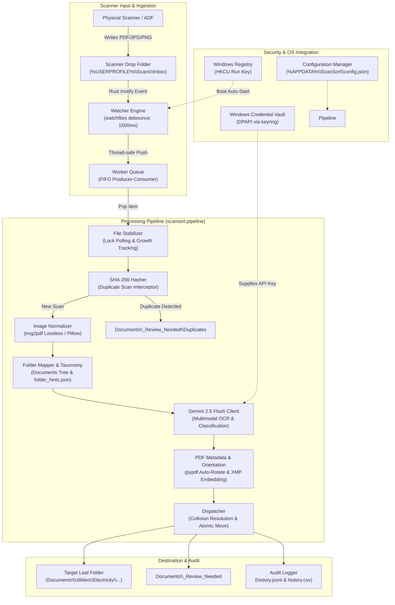
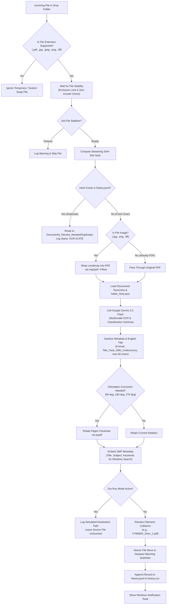

# ScanSort

> **Intelligent, Automated Desktop Document Organizer Powered by Google Gemini 2.5 Flash**

ScanSort is a zero-touch Windows desktop utility designed for automated, local document management. It monitors a scanner drop folder, waits for physical scanner writes to complete, indexes your pre-existing `Documents` directory hierarchy, classifies incoming scans via Google Gemini 2.5 Flash, automatically rights upside-down or sideways pages, embeds searchable metadata for native Windows Search indexing, standardizes filenames to `YYMMDD_<Description>.pdf`, and dispatches documents directly into the deepest matching subfolder.

---

## Architecture & System Design

ScanSort is built with modular, loosely coupled components designed around safety, speed, and privacy.

### System Component Architecture



---

### Ingestion & Processing Lifecycle



---

## Core Features

- **Zero-Leak Secret Vault:** Your Gemini API key is never written to plaintext config files. It is stored directly in the OS-encrypted credential vault (Windows Credential Manager / DPAPI via `keyring`).
- **Rust-Powered Filesystem Watcher:** Built on `watchfiles` (wrapping Rust's `notify` crate) with native debouncing to handle scanner buffers and multi-page ADF batch scans.
- **Deepest Subfolder Matching:** Scans your real `Documents` directory hierarchy and classifies scans into the most specific leaf folder. If no existing folder fits or confidence is below 70%, files route safely to `Documents/_Review_Needed/` (never inventing rogue folders).
- **Auto Page-Orientation:** Automatically corrects skewed, sideways, or upside-down scans (0°, 90°, 180°, 270°) using `pypdf`.
- **Native Windows Search Indexing:** Embeds document title, summary, and category keywords into standard PDF DocInfo and XMP metadata streams, enabling instant Windows Start Menu and Explorer search.
- **SHA-256 Duplicate Interception:** Computes cryptographic SHA-256 hashes for all scans. Re-scans are identified before filing and routed to `_Review_Needed/Duplicates/`, saving Gemini API quota.
- **Instant Move Reversal ("Undo"):** Provides an immediate single-command undo (`scansort undo`) that reverses the last filed scan back to your drop folder.
- **Dual Crash-Safe Audit Logs:** Maintains append-only `history.jsonl` (machine-readable structured log) and `history.csv` (Excel-compatible spreadsheet) in `%APPDATA%\ScanSort\`.
- **Dry-Run Mode:** Test and preview classification logic on your documents without moving or modifying files (`--dry-run`).
- **Windows Boot Auto-Start:** Automatically launches on user login via the `HKCU\Software\Microsoft\Windows\CurrentVersion\Run` registry key.

---

## Prerequisites & Installation

### Prerequisites
- Python 3.12 or newer
- [Astral `uv`](https://docs.astral.sh/uv/) (recommended for fast package management)
- A Google Gemini API key ([Google AI Studio](https://aistudio.google.com/))

### Installation via `uv`

```bash
# Clone repository
git clone https://github.com/stephen/scansort.git
cd scansort

# Install dependencies into virtual environment
uv sync
```

---

## Usage & CLI Reference

ScanSort provides an intuitive command-line interface:

### 1. Store Your Gemini API Key Securely
Store your API key in the Windows Credential Manager:
```bash
uv run python -m scansort config --set-key AIzaSyYourActualKeyHere
```
*The key is encrypted via DPAPI and never saved to any file on disk.*

### 2. View Current Configuration
Check active settings, folders, and verify your key is stored:
```bash
uv run python -m scansort config --show
```
*Output safely masks the API key (e.g. `AIza••••••••1234`).*

### 3. Customize Monitored Folders
```bash
# Set custom scanner drop folder
uv run python -m scansort config --watch-folder "C:\Scans\Inbox"

# Set custom documents destination directory
uv run python -m scansort config --documents-folder "D:\My Documents"
```

### 4. Configure Auto-Start on Windows Boot
```bash
# Enable run-on-startup (sets HKCU registry key)
uv run python -m scansort config --autostart enable

# Disable run-on-startup
uv run python -m scansort config --autostart disable
```

### 5. Preview Scans in Dry-Run Mode
Simulate categorization without altering any files:
```bash
uv run python -m scansort watch --dry-run
```

### 6. Start Live Background Monitoring
```bash
uv run python -m scansort watch
```

### 7. Undo the Last Document Move
Misplaced a document or want to re-scan? Reverse the last move instantly:
```bash
uv run python -m scansort undo
```
*Restores the file to its original location in your drop folder and marks the transaction as `UNDONE` in the audit log.*

### 8. Inspect Discovered Taxonomy
Verify the folders ScanSort will use for classification:
```bash
uv run python -m scansort rescan
```

---

## Folder Hints & Aliases (`folder_hints.json`)

If you have specific taxonomy folders whose purpose may not be obvious from the folder name alone, create a `folder_hints.json` file in `%APPDATA%\ScanSort\`:

```json
{
  "Finances/Utilities/Electricity": ["Origin Energy", "AGL", "power bill", "kWh"],
  "Medical/Dental": ["Bupa Dental", "cleaning", "orthodontics"],
  "Taxes/2026": ["ATO", "group certificate", "PAYG", "tax return"]
}
```

ScanSort automatically injects these keyword hints into the Gemini classification prompt to ensure 100% filing accuracy.

---

## File Naming & Collision Resolution

Documents are standardized following this format:
```
YYMMDD_<Description>.pdf
```
- **Date (`YYMMDD`):** Extracted issuance/statement date from document text. Defaults to today's date if absent.
- **Description:** English summary in `Title_Case_With_Underscores` (max 60 characters). Invalid Windows characters (`< > : " / \ | ? *`) and extra punctuation are stripped.
- **Collisions:** If a file with the target name already exists in that destination folder, ScanSort appends an incrementing counter:
  - `260901_Origin_Energy_Electricity_Bill.pdf`
  - `260901_Origin_Energy_Electricity_Bill_1.pdf`
  - `260901_Origin_Energy_Electricity_Bill_2.pdf`

---

## Building Standalone Windows Executable

ScanSort can be compiled into a standalone, portable Windows executable (`ScanSort.exe`) requiring zero runtime dependencies or Python installation on the client machine:

```bash
# Build standalone binary using PyInstaller spec
uv run pyinstaller scansort.spec
```

The output bundle is produced in `dist/ScanSort/ScanSort.exe`.

---

## Testing

```bash
# Run test suite
uv run pytest

# Code quality and formatting check
uv run ruff check .
```

---

## Documentation

- Detailed requirements and specifications: [Product Requirements Document (PRD)](docs/PRD.md)
